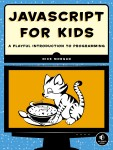

# HRYTSIUK VITALII

## Contacts
email: fahivchik1@gmail.com   
discord: GuruWithYou#8303

## About
I don't like to talk about myself.
I like to take a task and do it.

## Skills
### Tech stack
- Basic JavaScript
- Python
- HTML
- CSS, SCSS, BOOTSTRAP
- BEM

### Tools
- PyCharm
- VS Code
- GIT
- Figma 
- Photoshop, Illustrator 
- Chrome DevTools

## CodeExamples

### Codewars  

### Task
Complete the solution so that it splits the string into pairs of two characters. If the string contains an odd number of characters then it should replace the missing second character of the final pair with an underscore ('_').  

### Solution
```Python
def solution(s):
    result = []
    lenght_s = len(s)
    if lenght_s % 2:
        s += '_'
    for i in range(0, lenght_s, 2):
        result.append(s[i:i+2])
    return result
```
```JS 
function solution(s) {
    let result = new Array();
    let lenght_s = s.length;
    if (lenght_s % 2){
        s += '_';
    };
    for (let i = 0; i < lenght_s; i+=2){
        result.push(s.slice(i,i+2));
    }; 
    return result;
};
```  
## Education
- FRONT-END [ONLINE] (UKRAINE) SPRING 2020
- htmlacademy.ru
- w3schools.com
-  	
-  

## English level
### Intermediate(B1+)
- https://learnenglish.britishcouncil.org/online-english-level-test
-  